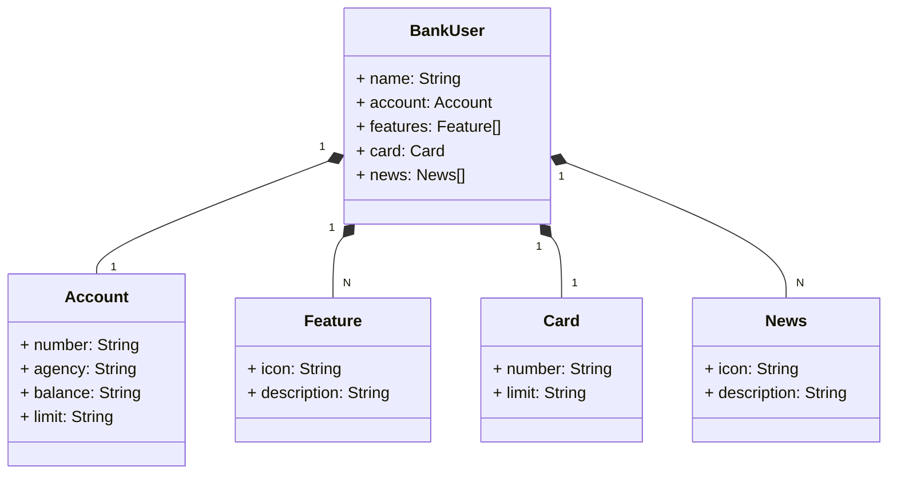

# Santander Dev Week
RESTful API Santander

## Class Diagram

```mermaid
classDiagram
  class BankUser {
    + name: String
    + account: Account
    + features: Feature[]
    + card: Card
    + news: News[]
  }

  class Account {
    + number: String
    + agency: String
    + balance: String
    + limit: String
  }

  class Feature {
    + icon: String
    + description: String
  }

  class Card {
    + number: String
    + limit: String
  }

  class News {
    + icon: String
    + description: String
  }

  BankUser "1" *-- "1" Account
  BankUser "1" *-- "N" Feature
  BankUser "1" *-- "1" Card
  BankUser "1" *-- "N" News
```
